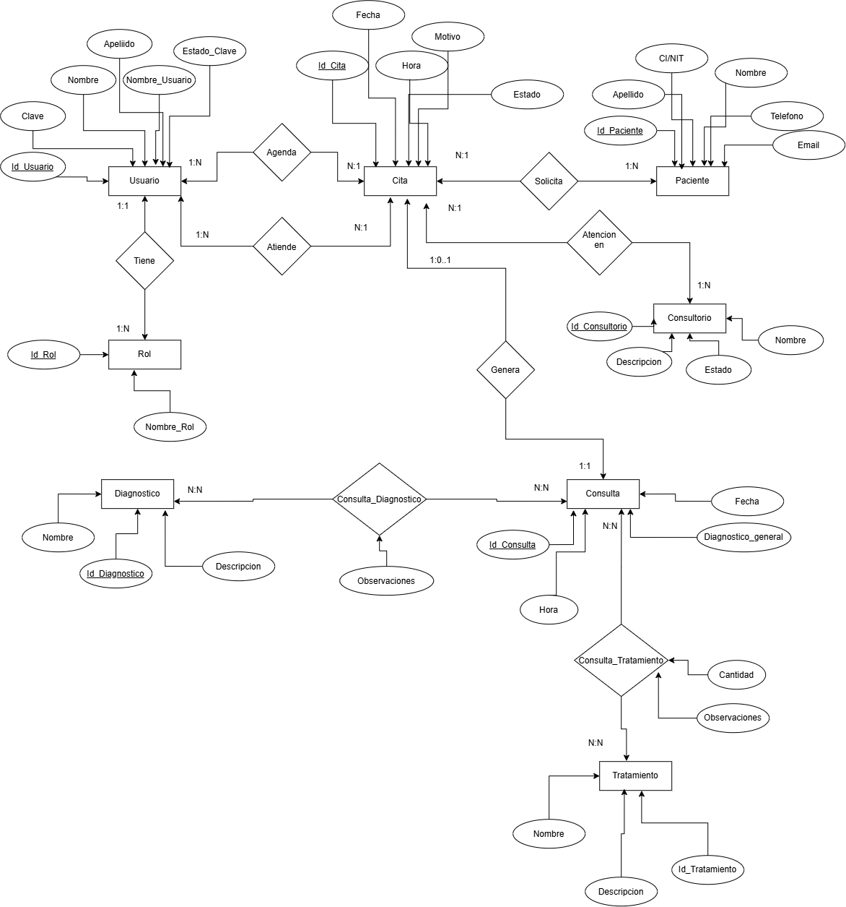

# Descripción de la problemática o requisitos

La clínica odontológica actualmente requiere mejorar el registro, organización y control de la información relacionada con sus pacientes y las consultas médicas. La información de los pacientes, citas, consultas, diagnósticos y tratamientos puede ser difícil de administrar cuando se maneja de forma manual o mediante registros que no se encuentran centralizados.

Entre los principales problemas se encuentran la dificultad para consultar rápidamente el historial de atenciones de un paciente, el control de las citas programadas, la asignación de los consultorios y el registro de los usuarios responsables de agendar y atender las citas. Asimismo, se requiere mantener organizada la información de los diagnósticos y tratamientos aplicados durante cada consulta.

La falta de un sistema de gestión puede ocasionar duplicidad o pérdida de información, dificultades para realizar consultas sobre los pacientes y sus atenciones, así como problemas para llevar un adecuado seguimiento de los diagnósticos y tratamientos realizados.

Por esta razón, se plantea el diseño de una base de datos para una clínica odontológica que permita almacenar, relacionar y consultar de manera organizada la información correspondiente a usuarios, roles, pacientes, citas, consultorios, consultas, diagnósticos y tratamientos.

# Diseño de la solución

Una clínica odontológica desea implementar una base de datos que permita gestionar y organizar la información de sus pacientes, citas y consultas médicas. Para ello, se establecen los siguientes requerimientos:

1. **Gestión de usuarios y roles.**
   La clínica cuenta con diferentes usuarios que utilizan el sistema. De cada usuario se registra su identificación, nombre, apellido, nombre de usuario, clave y estado de la clave. Cada usuario pertenece a un único rol y un rol puede estar asignado a uno o varios usuarios.

2. **Registro de roles.**
   De cada rol se conoce su identificación y nombre. Los roles permiten determinar las funciones que puede desempeñar cada usuario dentro del sistema.

3. **Registro de pacientes.**
   De cada paciente se registra su identificación, CI/NIT, nombre, apellido, teléfono y correo electrónico. Un paciente puede solicitar una o varias citas, mientras que cada cita corresponde a un único paciente.

4. **Registro de citas.**
   De cada cita se registra su identificación, fecha, hora, motivo y estado. Cada cita pertenece a un paciente y se programa en un consultorio determinado.

5. **Asignación del usuario que agenda la cita.**
   Una cita debe registrar el usuario encargado de agendarla. Un usuario puede agendar muchas citas, mientras que cada cita es agendada por un único usuario.

6. **Asignación del usuario que atiende la cita.**
   Una cita puede ser atendida por un usuario autorizado para realizar la atención odontológica. Un usuario puede atender muchas citas, mientras que cada cita puede tener un único usuario responsable de la atención. El usuario que atiende puede quedar sin asignar mientras la cita todavía no haya sido atendida.

7. **Gestión de consultorios.**
   De cada consultorio se registra su identificación, nombre, descripción y estado. Un consultorio puede tener muchas citas programadas, mientras que cada cita se realiza en un único consultorio.

8. **Registro de consultas.**
   Cuando una cita es atendida, puede generar una consulta médica. De cada consulta se registra su identificación, fecha, hora y observaciones. Una cita puede no generar todavía una consulta si aún no ha sido atendida, mientras que una consulta corresponde a una cita.

9. **Registro de diagnósticos.**
   De cada diagnóstico se registra su identificación, nombre y descripción. Una consulta puede tener uno o varios diagnósticos y un mismo diagnóstico puede aparecer en diferentes consultas. Por lo tanto, existe una relación de muchos a muchos entre CONSULTA y DIAGNOSTICO.

10. **Registro de tratamientos.**
    De cada tratamiento se registra su identificación, nombre, descripción y precio. Una consulta puede recibir uno o varios tratamientos y un mismo tratamiento puede aplicarse en diferentes consultas. Por lo tanto, existe una relación de muchos a muchos entre CONSULTA y TRATAMIENTO.

11. **Información adicional de los diagnósticos de una consulta.**
    Debido a que un diagnóstico puede aparecer en diferentes consultas, la relación entre CONSULTA y DIAGNOSTICO se gestiona mediante la entidad intermedia CONSULTA_DIAGNOSTICO, donde se puede registrar una observación específica para ese diagnóstico dentro de una determinada consulta.

12. **Información adicional de los tratamientos de una consulta.**
    La relación entre CONSULTA y TRATAMIENTO se gestiona mediante la entidad intermedia CONSULTA_TRATAMIENTO, donde se registra información específica del tratamiento aplicado en una consulta, como la cantidad, el precio y una observación.

## Relaciones principales

Las relaciones establecidas entre las entidades son las siguientes:

| Entidad     | Relación      | Entidad     | Cardinalidad |
| ----------- | ------------- | ----------- | ------------ |
| ROL         | TIENE         | USUARIO     | 1:N          |
| PACIENTE    | SOLICITA      | CITA        | 1:N          |
| USUARIO     | AGENDA        | CITA        | 1:N          |
| USUARIO     | ATIENDE       | CITA        | 1:N          |
| CONSULTORIO | SE REALIZA EN | CITA        | 1:N          |
| CITA        | GENERA        | CONSULTA    | 0..1:1       |
| CONSULTA    | TIENE         | DIAGNOSTICO | N:N          |
| CONSULTA    | RECIBE        | TRATAMIENTO | N:N          |

Las relaciones **N:N** se representan mediante las entidades intermedias:

* **CONSULTA_DIAGNOSTICO**, para relacionar las consultas con sus diagnósticos.
* **CONSULTA_TRATAMIENTO**, para relacionar las consultas con los tratamientos.
* 
